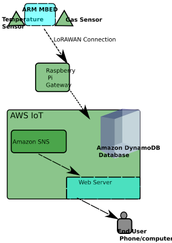

#SETUP:
---

## DEVELOPMENT BOARD:
---

I am using an ARM Mbed development board, but this is just for building a prototype. I will probably use an STM32 board in production. However, in both staging and production, I will use an ARM Cortex-based board.

For LoRaWAN communications(I am using LoRA network) I use an Mbed OS Enabled development board together with a LoRa shield.
A LoRA gateway can be built using a Raspberry Pi and an IMST iC880A concentrator. At about 150 euros, this is a cost-efficient option.

The process for setting up a Raspberry Pi gateway is [here](https://github.com/ttn-zh/ic880a-gateway/wiki).

__NOTE:__A network server is needed to interpret the LoRA packets and send them to the app or the cloud for processing. Here I am using ___The Things Network___ network server, an open source, globally distributed network service that also has a free hosted community edition.
The Things Network allows you to hook into its service through an MQTT client and forward your data to the cloud service of your choice (or straight to your application).

### __INTRODUCTION:__
__This project used an ARM Mbed development board.__

The ARM Mbed Ethernet IoT starter kit is composed of an ARM M4 cortex running up to 120 MHz and has a 1024 KB Flash memory as well as 256KB RAM and lots of peripheries and interfaces.
The board type is FRDM-K64F.

IBM provides an ARM Mbed Ethernet IOT starter kit (development board + USB cable + a breadboard with jumper wires).

ARM Mbed programs use C++ language.

# COMPONENTS/PERIPHERALS FOR DEVELOPMENT BOARD:
---

__The following are the required components:__

1. Temp sensor LM75B.
2. Gas sensor MQ4 - for Methane gas readings.
3. Registers.
4. 2N3904(transister).
5. LEDs. 
6. LoraWAN shields, which can be either [SX1276MB1xAS](https://developer.mbed.org/components/SX1276MB1xAS/) which is a shield based on the SX1276 transceiver., [SX1272MB2xAS](https://developer.mbed.org/components/SX1272MB2xAS/) which is shield based on the SX1276 transceiver, and finally, the [L-TEK FF1705](https://developer.mbed.org/components/L-TEK-FF1705/).

## COMMUNICATION WITH RASPBERRY PI GATEWAY:
---
This is done via LoRAWAN.
LoRa stands for long-range communications technology that's intended for low-power, long-range communications of battery powered IoT devices(Low-power wide-area networks). It supports bidirectional communications of networks and millions of devices.
It also has a good link budget.

__SYNOPSIS:__
---

There are various MQ gas sensors and of importance in this project is the MQ-4 gas sensor which can be used to monitor the Methane gas in stored food such as in granaries and silos in real-time. 
Info on MQ gas sensor can be found [here](https://components101.com/sensors/mq-4-methane-gas-sensor-pinout-datasheet).
The above web page lists the following as the advantages of MQ-4:
MQ-4 Gas Sensor Features

1.    Good sensitivity to Combustible gas in wide range
2.    High sensitivity to CH4, Natural gas.
3.    Small sensitivity to alcohol, smoke.
4.    Fast response Stable and long life
5.    Simple drive circuit

The respective gas values are recorded from the Analog In signals of the ARM Mbed which then converts the signals to parts-per-million(ppm) readings, and this info is sent to a Raspberry pi zero (via the MQTT protocol) which publishes the data to a database. 

There is a web page hosted on an AWS server where the user can see a graph of readings in the database. In addition to displaying the readings, the website gives the user the opportunity to set a threshold ppm value.

If the gas readings from the sensors exceed this threshold ppm value, the user will receive a text message/email informing them of the high reading and allowing them to act accordingly

For the __temperature sensor__, the LM75B sensor and it's respective library is used.

